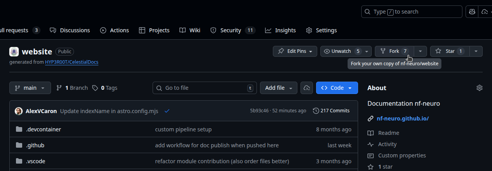
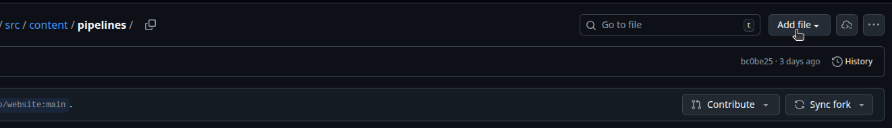

import { Steps } from '@astrojs/starlight/components';
import { Tabs, TabItem } from '@astrojs/starlight/components';

## Using the browser
<Steps>

1. If you don't **own a fork** of the [website repository](https://github.com/nf-neuro/website),
   naviguate to it in your browser and create one

   

2. On your forked repository page, naviguate to `src/content/pipelines` and click on the
   **Add file** button in the top right corner and select the **Create new file** option.

   
   
3. Name the new file `<pipeline name>.yaml` and edit its content to reflect the following :
   ```yaml
   name: <name of the pipeline>
   organisation: <name of the host organisation on Github>
   documentation: <(optional) link to the pipeline's documentation website>
   ```

4. Commit your changes to a new branch on your fork, and open an **Pull Request** on the
   [main website repository](https://github.com/nf-neuro/website/pulls)

</Steps>

## Cloning locally

<Steps>

1. If you don't **own a fork** of the [website repository](https://github.com/nf-neuro/website),
   naviguate to it in your browser, create one and clone it locally.

   

2. Create a new branch to host the code modifications.

3. Add a new file in `src/content/pipelines`, named `<pipeline name>.yaml` and edit its content
   to reflect the following :
   ```yaml
   name: <name of the pipeline>
   organisation: <name of the host organisation on Github>
   documentation: <(optional) link to the pipeline's documentation website>
   ```

4. Commit your changes, push the branch and open an **Pull Request** on the
   [main website repository](https://github.com/nf-neuro/website/pulls)

</Steps>